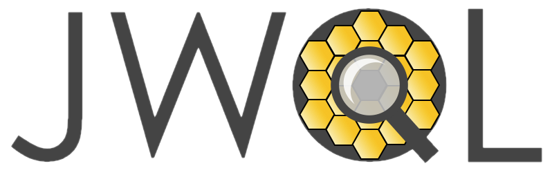

.. jwql documentation master file, created by
   sphinx-quickstart on Wed Apr  4 10:30:20 2018.
   You can adapt this file completely to your liking, but it should at least
   contain the root `toctree` directive.

Welcome to the ``jwql`` API documentation!
==========================================

The JWST Quicklook Application (``JWQL``) is a web application and automation framework for analyzing and monitoring the JWST instruments and their data.  This site serves as the official API documentation for the project.  The ``JWQL`` source code, installation instructions, and instructions for issue reporting and feature requests can be found in the `jwql GitHub repository <https://github.com/spacetelescope/jwql>`_.

.. toctree::
   :maxdepth: 1
   :caption: Contents:

API documentation
=================

.. toctree::
   :maxdepth: 1
   :caption: Contents:

   common_monitors.rst
   database.rst
   edb.rst
   jwql_monitors.rst
   instrument_monitors.rst
   tests.rst
   utils.rst
   website.rst

Indices and tables
==================

* :ref:`genindex`
* :ref:`modindex`
* :ref:`search`
